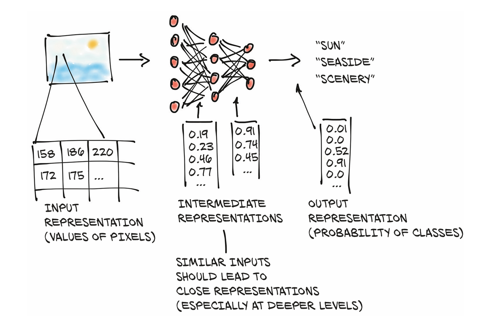
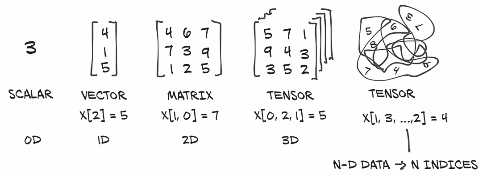
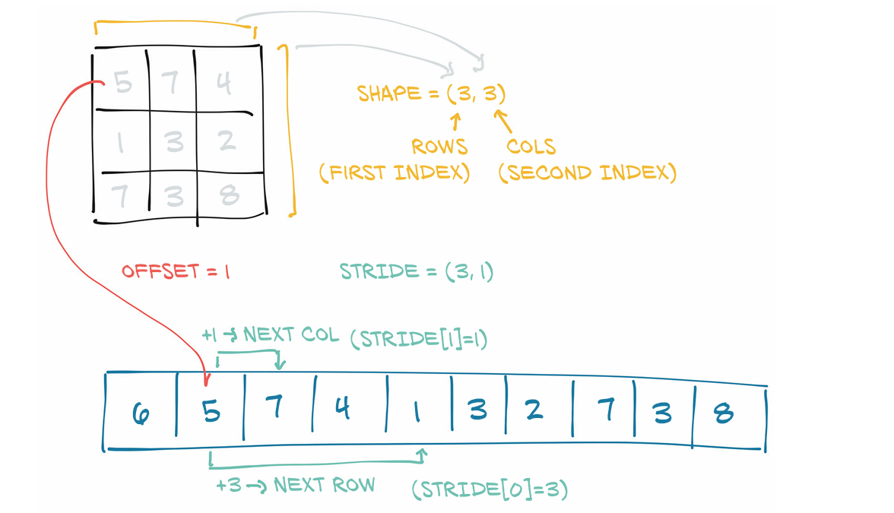
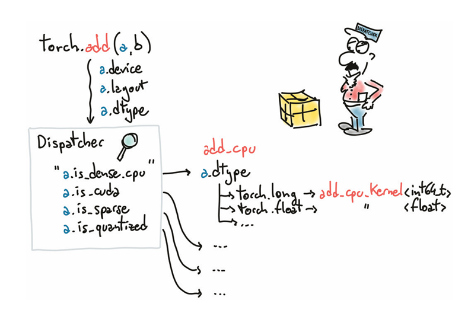

### It starts with a *TENSOR*

They invariably consisted of taking data in some form, like images or text, and producing data in another form, like labels, numbers, or more images or text. 
The process begins by converting our input into floating-point numbers. 💬➡️🔢

#### Image2Float

#### Tensor 🧱 
A tensor is an array: that is, a data structure that stores a collection of numbers that are accessible individually using an index, and that can be indexed with multiple indices.

In Python lingo, list of list homogenous float datatype

  [markdown]
how tensor works::

- named_tensor [blog](http://nlp.seas.harvard.edu/NamedTensor)
    - torch.randn(3, 5, 5) # shape [channels, rows, columns]
- einsum
- ellipsis (...) [blog](https://rockt.github.io/2018/04/30/einsum)
- refne_names
- align_as

Element Types::

- Numbers in python are object (process is called `boxing`)  if we need to store a small number of numbers, but allocating millions gets very inefficient
- Lists is Sequential collection of objects.
- The Python interpreter is slow compared to optimized, compiled code

[PyTorch Official](http://pytorch.org/docs)

- Creation ops—Functions for constructing a tensor, like ones and from_numpy
- Indexing, slicing, joining, mutating ops—Functions for changing the shape, stride, or content of a tensor, like transpose
- Math ops—Functions for manipulating the content of the tensor through
    - computations
        - Pointwise ops—Functions for obtaining a new tensor by applying a function to each element independently, like abs and cos
        - Reduction ops—Functions for computing aggregate values by iterating through tensors, like mean, std, and norm
        - Comparison ops—Functions for evaluating numerical predicates over tensors, like equal and max
        - Spectral ops—Functions for transforming in and operating in the frequency domain, like stft and hamming_window
        - Other operations—Special functions operating on vectors, like cross, or matrices, like trace
        - BLAS and LAPACK operations—Functions following the Basic Linear Algebra Subprograms (BLAS) specification for scalar, vector-vector, matrix-vector, and matrix-matrix operations
- Random sampling—Functions for generating values by drawing randomly from probability distributions, like randn and normal
- Serialization—Functions for saving and loading tensors, like load and save
- Parallelism—Functions for controlling the number of threads for parallel CPU execution, like set_num_threads

contiguous chunks of memory managed by `torch.Storage`
PyTorch Tensor instance is a view of such a Storage instance that is capable of indexing into that storage using an offset and per-dimension strides.
The underlying memory is allocated only once, however, so creating alternate tensor-views of the data can be done quickly regardless of the size of the data managed by the Storage instance.
The layout of a storage is always one-dimensional, regardless of the dimensionality of any and all tensors that might refer to it.
- contiguous()
- storage()

##### Tensor metadata: 

###### Size
The size (or shape, in NumPy parlance) is a tuple indicating how many elements across each dimension the tensor represents.

###### offset
The storage offset is the index in the storage corresponding to the first element in the tensor

###### stride
The stride is the number of elements in the storage that need to be skipped over to obtain the next element along each dimension

##### GPU
- to('cuda')

##### NumPy interoperabilit
NumPy due to its ubiquity in the Python data science ecosystem.

##### Generalized tensors are tensors
- TPUs
- sparse tensor
- quantized ( specialized computational backend)

`note`:PyTorch uses a trailing underscore to indicate that a function operates in place on a tensor